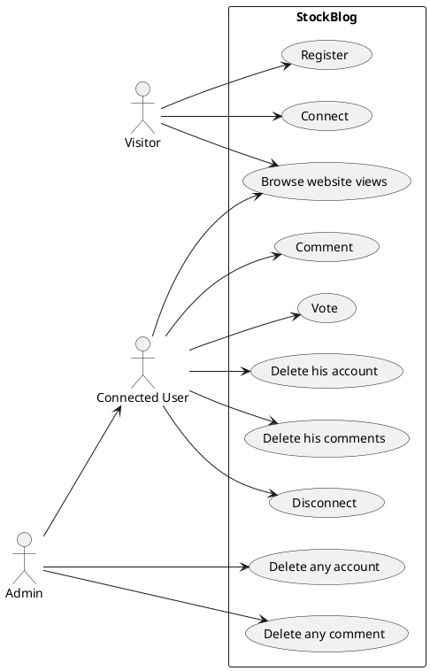
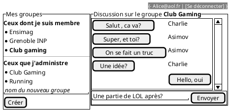

---
title: StockBlog 
author:  
- MIGNE Matthieu
- SORIA-RAMOS Gabriel
--- 

## Cahier des charges

Ici vous décrivez les fonctionnalités souhaitées et celles effectivement mises en oeuvre. Avec un diagramme UML des cas d'usage et des maquettes des vues souhaitées et des captures d'écran de ce qui a été réalisé.

### Cas d'usage



### Maquettes

A modifier/compléter...



### Captures d'écran

A compléter

### API mise en place

Donner le lien vers la documentation swagger et/ou faire un tableau récapitulant l'API

A compléter

## Architecture du code

### FrontEnd

Indiquer ici l'organisation de votre code. Et les choix faits pour le frontend.

### Backend

#### Schéma de votre base de donnée

A modifier/compléter...

```plantuml
class User{
  name
  email
  passhash
  isAdmin : boolean
}

class Message{
  content
}

class Group{
  name
}

User "1" -- "n" Message : posts
Group "1" -- "n" Message : contains

User "n" -- "n"  Group : is member 
User "1" -- "n"  Group : create and own
```

#### Architecture de votre code

Indiquer ici l'organisation de votre code. Et les choix faits pour le backend.

### Gestion des rôles et droits

Expliquer ici les différents rôles mis en place, et comment ils sont gérés dans votre code.

- Coté backend

- Coté frontend


## Test

### Backend

Décrivez les tests faits au niveau du backend, leur couverture.

### Frontend

Décrivez les tests faits au niveau du backend, leur couverture.

## Intégration + déploiement (/3)

Décrivez ici les éléments mis en place au niveau de l'intégration continue 

## Installation

Donner les éléments pour installer l'application sur une machine nue à partir de votre dépôt
