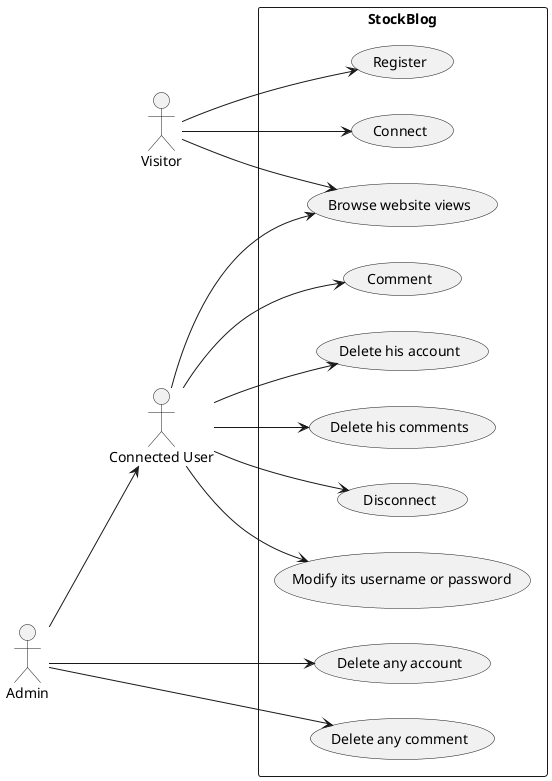

---
title: StockBlog 
author:  
- MIGNE Matthieu
- SORIA-RAMOS Gabriel
- EL AHMAR Anas
--- 

**The website: [StockBlog](https://stock-blog.netlify.app/)**

## Cahier des charges

Nous souhaitons créer un site affichant les courbes de différents actifs bousiers et qui donne la possibilité aux utilisateurs d'interagir à leur sujet en commentant, ou en pariant sur une montée ou une descente de la valeur de l'actif à la prochaine unité de temps. Seul les utilisateurs connectés peuvent commenter. 

Le site comportera 2 vues principales: 
- la page d'accueil qui a une boîte de sélection pour choisir le graphique à afficher avec les commentaires associés et donne la possibilité d'accéder aux paramètres de son compte
- la page de ses paramètres de compte pou changer son nom d'utilisateur, son mot de passe, voir l'historique de ses messages, supprimer ses messages ou son compte.

### Cas d'usage



### Captures d'écran

A compléter

### API mise en place

Donner le lien vers la documentation swagger et/ou faire un tableau récapitulant l'API

[Swagger doc](https://stock-blog-backend.osc-fr1.scalingo.io/doc/)

## Architecture du code

### FrontEnd

Indiquer ici l'organisation de votre code. Et les choix faits pour le frontend.

#### organisation

Le frontend est divise en 4 dossiers:

 ##### assets 
  Contient les images utilises par le site.

 ##### components
  Contient les blocks ou elements utilises au sein des pages, a l'exeption de deux fichiers api et auth qui gerent respectivement la communication avec le backend pour recuperer les donnes et l'authentification de l'utilisateur.

 ##### css
  Contient les fichiers qui decrivent les styles des pages.

 ##### pages
  Contient les differentes pages du site.

Mis a part ces fichiers il y a App qui contient les differentes routes navigables par l'utilisateur et main qui est le premier fichier execute.

#### Les choix
  Au noveau des choix il a ete decide que toute lea partie graphique irait sur le frontend comme attendu, l'authentification des utilisateurs par l'intermediaire du backend ce procede et detaille d'avantege dans la partie suivante. De meme concernant l'API alpaca  qui permet de recuperer les donnees des courbes, celle ci necesitant  l'usage d'un token pour recuperer les donnees (ce qui peut entrainer des soucis au niveau de la securite). Il a ete choisi de fgerer cela depuis le backend.


### Backend

#### Schéma de votre base de donnée

```plantuml
class users{
  name
  email
  passhash
  role
}

class messages {
  id
  symbol
  content
  userMail
  createdAt
  updatedAt
}

users "1" --> "n" messages : posts
```

#### Architecture de votre code

  Le backend est organise dans les repertoires suivants :

  ###### tests
    Dossier qui gere les tests

  ###### controllers
    Fichiers contenant les fonctions qui facilitent la recuperation et insertion des donnees.

  ###### models
    Les modeles de la base de donnees et des differents tableaux qui sont contenus.

  ###### routes
    Les liens entres les requetes Api du frontend et les informations recuperes et renvoyees par le backend.
    Separes poar chaque type de donnee.

  ###### utils
    Differentes fonctions utiles opour un ou plusieurs fichiers.

app.js et server.js fichiers permettant d'instancier le backend.
  


Indiquer ici l'organisation de votre code. Et les choix faits pour le backend.

### Gestion des rôles et droits

Expliquer ici les différents rôles mis en place, et comment ils sont gérés dans votre code.

Il y a 3 rôles: visiteur, utilisateur connecté, et administrateur.

- Coté backend

Le rôle est vérifié à l'aide du token transmis par le client, ensuite nous utilisons une fonction middleware pour vérifier si le token est bien un token utilisateur ou si le token est bien un token administrateur. Certaines fonctionnalités ne sont accessbles que par l'utilisateur concerné ou l'administrateur, dans ces cas-là on va vérifier si l'utilisateur est administrateur, et si non on va vérifier que l'email stocké dans le payload du token transmis par le client correspond bien à l'email de l'utilisateur concerné.

- Coté frontend

Le rôle est stocké en local afin de savoir quelle vue afficher. Il est donc facilement possible d'avoir accès aux vues administrateur pour un utilisateur non autorisé, cependant cela n'est pas problématique, car pour toute action le token est vérifié côté backend donc si un utilisateur non autorisé effectue des appels côté backend pour des fonctionnalités administrateur, il sera interdit en backend.

## Test

### Backend

Décrivez les tests faits au niveau du backend, leur couverture.

### Frontend

Décrivez les tests faits au niveau du backend, leur couverture.

## Intégration + déploiement (/3)

Nous avons déployé deux dépôts, un sur Scalingo pour le backend et un autre sur Netlify pour le backend.

## Installation

Pour installer l'application il faut effectuer dans le terminal à la racine du projet:
```bash
npm install
```
Un script installera les dépendances pour le backend et le frontend automatiquement.

Ensuite pour lancer l'application en mode développeur il faut exécuter:

```bash
npm run dev
```

Ou en mode production:

```bash
npm run start
```
